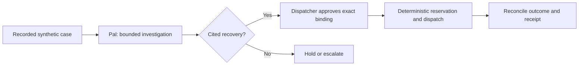

# TrashPal

TrashPal is a local operator workspace for reviewing one commercial organics collection exception, approving an exact recovery, and reconciling an uncertain dispatch before retrying it.

> **Status: Work in progress.** The local demo is functional, but the repository remains under active development and is not production-ready or operational guidance.

TrashPal is an independent fictional project, not an official PostHog product. It was distilled from [self-driving-trash-palace](https://github.com/owieschon/self-driving-trash-palace), the full build, including how it was built and what it does not prove.

## Why this exists

TrashPal began as a demonstration for a friend who works at a local company that helps turn residential and commercial food scraps into compost and soil. I wanted to make one claim concrete: agents can help with physical operations outside conventional software workflows when context, authority, uncertainty, and recovery are designed into the product.

The company did not sponsor, test, or endorse TrashPal. The missed-collection workflow and all repository data are fictional; they are a design exercise, not a representation of that company's operations.

## One-minute reviewer path

TrashPal shows a bounded agent operating around a physical service exception. Pal may inspect case-scoped evidence and prepare a cited recovery. Deterministic lifecycle code, not Pal, enforces approval, creates the durable operation, sends the dispatch request, and reconciles an uncertain acknowledgement.



The default local demo uses a deterministic reasoner and does **not** contact a model provider. It is an architecture demonstration, not evidence of live-model quality or operational performance.

Run the complete local verification suite with:

```sh
pnpm check
```

Read the [architecture contract](docs/architecture/CORE_BUILD_CONTRACT.md), [synthetic scenario corpus](docs/architecture/SYNTHETIC_SEED_CORPUS.md), and [local verification receipt](artifacts/evidence/core-build-local-receipt.md). The receipt documents what the local fixtures prove and, equally importantly, their limits.

## Run the local demo

Use Node 22 or later, Corepack, and Docker. Install the pinned dependencies once with `corepack enable && pnpm install --frozen-lockfile`.

Run these commands in three terminals from the repository root:

```sh
pnpm demo:services
```

```sh
pnpm demo:api
```

```sh
pnpm demo:web
```

Open [http://127.0.0.1:3212](http://127.0.0.1:3212). The browser flow is source records, prepare, approve and reserve, dispatch, reconcile, then receipt.

## Local-demo boundary

The web client calls the loopback API through same-origin `/v1` requests. The API issues an HttpOnly local-demo cookie. PostgreSQL, VROOM, case records, and the lost-ack dispatch profile run locally. This demo does not contact a CRM, fleet provider, model provider, analytics service, or cloud account.
