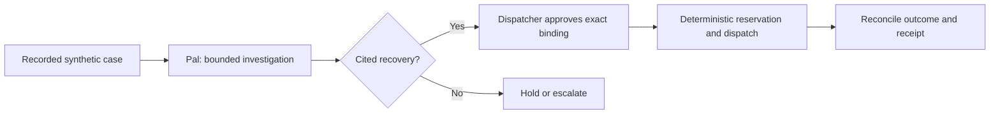

# TrashPal

TrashPal is a work-in-progress reference application for one commercial organics collection
exception. Its local operator workspace exists because a provider can accept a dispatch while its
acknowledgement is lost. A blind retry can duplicate work, while assuming failure can leave a
missed collection unresolved.
A dispatcher therefore reviews a proposed recovery, approves the exact payload, and reconciles an
uncertain dispatch before any retry.

> **Status: Work in progress.** The local demo exercises one synthetic recovery loop. It is not a deployable service, production-ready operational guidance, or evidence of live-provider performance.

Pal may inspect case-scoped evidence and prepare a cited recovery. Deterministic lifecycle code owns
approval, dispatch, reconciliation, and the final receipt. The missed-collection workflow and every
repository record are synthetic; they do not represent a real operation.

## Trace the recovery path

The local path makes each authority transition inspectable. Pal prepares; the dispatcher approves;
the lifecycle reserves and sends; reconciliation decides what the evidence supports.



Diagram: A recorded synthetic case enters a bounded investigation. A cited recovery may proceed to exact dispatcher approval, durable dispatch, outcome reconciliation, and a receipt; an unsupported recovery stops or escalates instead.

The default local demo uses a deterministic reasoner and does **not** contact a model provider. It is an architecture demonstration, not evidence of live-model quality or operational performance.

Use Node 22 or later and Corepack. Install the pinned dependencies once:

```sh
corepack enable
pnpm install --frozen-lockfile
```

Run the complete local verification suite with:

```sh
pnpm check
```

Read the [architecture contract](docs/architecture/CORE_BUILD_CONTRACT.md), [synthetic scenario corpus](docs/architecture/SYNTHETIC_SEED_CORPUS.md), and [local verification receipt](artifacts/evidence/core-build-local-receipt.md). The receipt documents what the local fixtures prove and, equally importantly, their limits.

## Run the local demo

Start Docker, then run these commands in three terminals from the repository root, in this order:
services, API, then web.

```sh
pnpm demo:services
```

```sh
pnpm demo:api
```

```sh
pnpm demo:web
```

Open [http://127.0.0.1:3212](http://127.0.0.1:3212). The browser flow is source records, prepare, approve and reserve, dispatch, reconcile, then receipt.

## Local-demo boundary

The web client calls the loopback API through same-origin `/v1` requests. The API issues an HttpOnly local-demo cookie and resets its dedicated loopback demo schema on startup. PostgreSQL, VROOM, case records, and the lost-ack dispatch profile run locally. This demo does not contact a CRM, fleet provider, model provider, analytics service, or cloud account.
